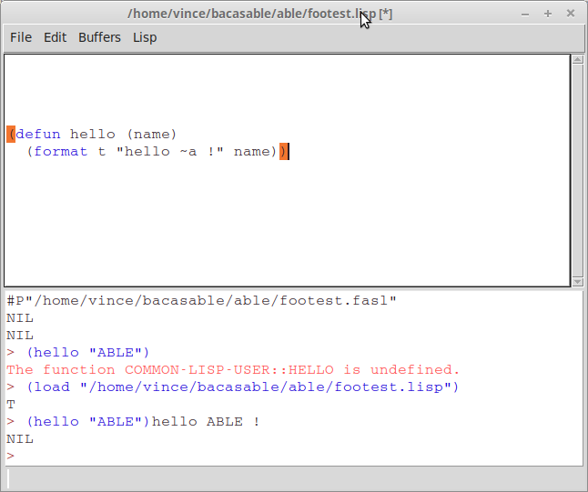
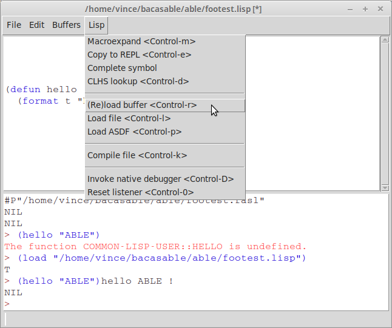

ABLE is a Common Lisp editor based on Tcl/Tk.

homepage: https://common-lisp.net/project/able/

How to start it:

- clone the repository where ASDF can find it (in ~/quicklisp/local-projects)
- `(ql:quickload "able")`
- `(able::start)`

Features:

- REPL
- editor with matching parenthesis highlighting, simple syntax formatting, symbols completion
- menus with available commands:
  - manage buffers
  - talk to the Lisp: macroexpand, load file or buffer, compile file, lookup symbol on the CLHS
  - etc

Missing features:

- graphical interactive debugger (only native debugger available)

